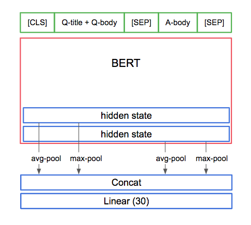

## Google quest challenge

----
https://www.kaggle.com/c/google-quest-challenge

#### Task
Identify and segment the required class of cloud organization from given satellite images.
240th solution, no post-processing

#### Networks
* BERT
* Pooling and then concatenation of last few hidden states from BERT
* Multi-sample dropout

#### Data
* 5-fold split
* Augmentation with multiple truncations of the sequence (head, tail, mix)
* TTA, same from multiple truncations

#### Optimizer
* AdamW with linear warmup and linear decay
* BCE Loss for 30 multi-labels

#### Environment
kaggle kernel with nvidia tesla p100  
nvidia [apex](https://www.kaggle.com/shutil/nvidia-apex)  
pytorch 1.2.0  
